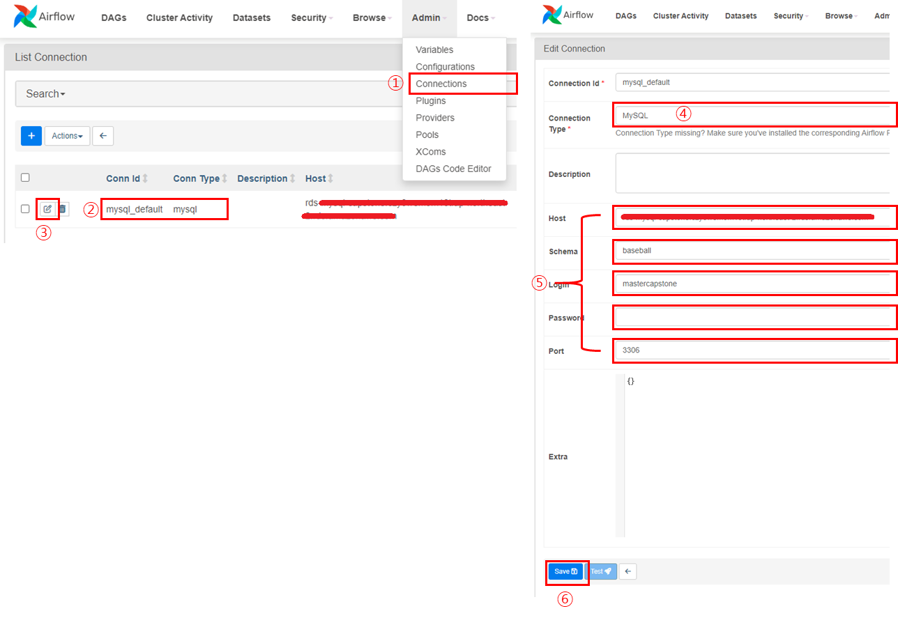

--- 
published: true
layout: single
title: "Airflow"
---

### Airflow 설치

1. AWS EC2 프리티어 생성
  
2. EC2 생성 시 만든 키페어 (예 capstone.pem) 파일을
  이용하여 ssh 로그인
  
3. 탄력적 IP 생성 후
  생성한 인스턴스에 할당
  
4. **ssh 로 접속**
  
    ```
    ssh -i "capstone.pem" ec2-user@{퍼블릭 IPv4 DNS}
    ```
  
5. **EC2 스왑 파일 추가 (AWS 프리티어로 EC2를 사용하면서 발생하는 느려지는 문제 해결 방법)**
    ```bash
    $ sudo dd if=/dev/zero of=/swapfile bs=128M count=16    # swap 메모리를 할당
    $ sudo chmod 600 /swapfile                              # 스왑 파일에 대한 읽기 및 쓰기 권한 업데이트
    $ sudo mkswap /swapfile # Linux 스왑 영역을 설정
    $ sudo swapon /swapfile # 스왑 공간에 스왑 파일을 추가하여 스왑 파일을 즉시 사용할 수 있도록 만듦
    $ sudo swapon -s  # 성공했는지 확인
    ```
    
   - /etc/fstab 파일을 편집하여 부팅 시 스왑 파일을 활성화
    
    ```bash
    $ sudo nano /etc/fstab
    # 파일 끝에 다음 줄을 새로 추가하고 파일을 저장(Ctrl+x 누른 후 y)한 다음 종료
    /swapfile swap swap defaults 0 0
    ```
    
     - 확인
    
    ```bash
    $ free -h
    ```
    

6. 한국시간 설정

    ```bash
    $ sudo rm /etc/localtime
    $ sudo ln -s/usr/share/zoneinfo/Asia/Seoul/etc/localtime
    ```

      - /etc/sysconfig/clock 파일을 열어 ZONE 값을 UTC에서 Asia/Seoul 으로 변경해준다.
  

    ```bash
    $ sudo nano /etc/sysconfig/clock
    ```

7. AWS Console 에서 인스턴스 재부팅

8. Airflow 설치
    ```bash
    $ sudo yum install python3-virtualenv
    $ virtualenv airflow
    $ cd airflow
    $ source bin/activate
    $ pip install apache-airflow
    ```
    - AIRFLOW_HOME 등록 
    ```bash
    $ nano ~/.bash_profile
    # 아래 내용 추가 후 저장(Ctrl+x 누른 후 y)
    export AIRFLOW_HOME=~/airflow
    # 변경 내용 shell 적용
    $ source ~/.bash_profile
    ```

    - airflow-code-editor 설치
    ```bash
    $ pip install airflow-code-editor
    $ airflow db init
    # airflow 어드민 사용자 등록
    $ airflow users create –username admin –firstname FirstName –lastname LastName –role Admin --email 메일주소
    ```

    - dag 저장 폴더 생성
    ```bash
    $ mkdir dags
    ```
9. airflow-providers-mysql 설치 
    ```bash
    # mysql client 설치 
    $ sudo su –
    $ dnf -y localinstall https://dev.mysql.com/get/mysql80-community-release-el9-4.noarch.rpm
    $ dnf -y install mysql mysql-community-client
    $ exit 
    $ sudo yum install mysql-devel –y
    $ sudo yum install gcc libxml2-devel libxslt-devel python-devel
    $ pip install apache-airflow-providers-mysql
    ```

    - libstdc++.so.6 오류 조치를 위해 아래 내용 추가
    ```bash
    $ nano ~/.bash_profile
    # 아래 내용 추가 후 저장(Ct기+x 누른 후 y)
    export LD_PRELOAD=/lib64/libstdc++.so.6:$LD_PRELOAD
    # 변경 내용 shell 적용
    $ source ~/.bash_profile    
    ```

10. Airflow connections 에 mysql connection정보 등록


11. Airflow 실행 
    ```bash
    $ airflow webserver --port 8080 
    $ airflow scheduler 
    ```

    - 다음은 ssh 세션 종료 시 서비스도 종료되므로 백그라운드로 실행 방법
    ```bash
    $ nohup airflow webserver --port 8080 > webserver.log 2>&1 &
    $ nohup airflow scheduler > scheduler.log 2>&1 &    
    ```


