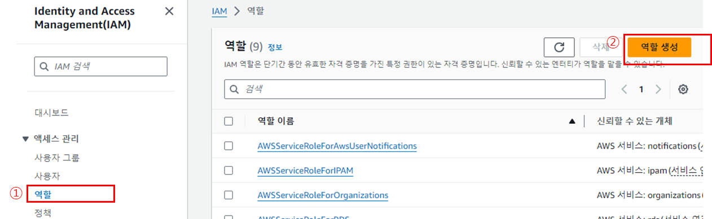
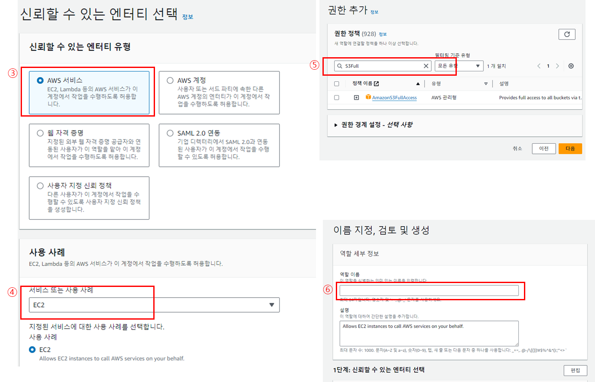
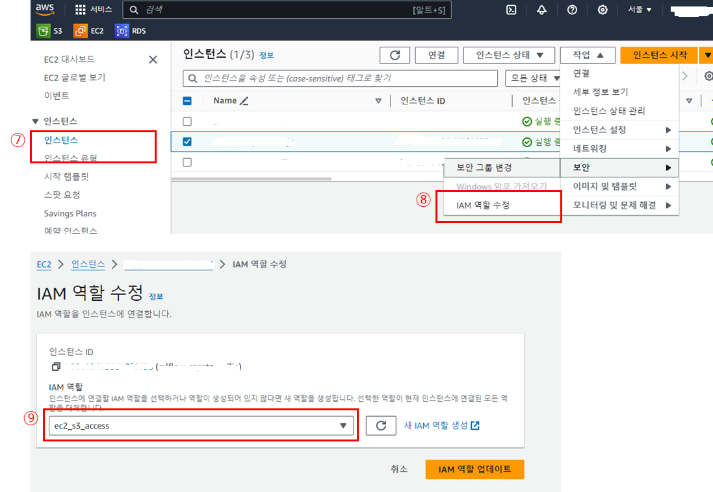
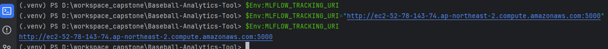

--- 
published: true
layout: single
title: "MLflow 설치"
---

### MLflow 설치

1. AWS EC2 프리티어 생성
  
2. EC2 생성 시 만든 키페어 (예 capstone.pem) 파일을 이용하여 ssh 로그인
  
3. 탄력적 IP 생성 후 생성한 인스턴스에 할당
  
4. **ssh 로 접속**
  
    ```
    ssh -i "capstone.pem" ec2-user@{퍼블릭 IPv4 DNS}
    ```
  
5. **EC2 스왑 파일 추가 (AWS 프리티어로 EC2를 사용하면서 발생하는 느려지는 문제 해결 방법)**
    ```bash
    $ sudo dd if=/dev/zero of=/swapfile bs=128M count=16    # swap 메모리를 할당
    $ sudo chmod 600 /swapfile                              # 스왑 파일에 대한 읽기 및 쓰기 권한 업데이트
    $ sudo mkswap /swapfile # Linux 스왑 영역을 설정
    $ sudo swapon /swapfile # 스왑 공간에 스왑 파일을 추가하여 스왑 파일을 즉시 사용할 수 있도록 만듦
    $ sudo swapon -s  # 성공했는지 확인
    ```
    
   - /etc/fstab 파일을 편집하여 부팅 시 스왑 파일을 활성화
    
    ```bash
    $ sudo nano /etc/fstab
    # 파일 끝에 다음 줄을 새로 추가하고 파일을 저장(Ctrl+x 누른 후 y)한 다음 종료
    /swapfile swap swap defaults 0 0
    ```
    
     - 확인
    
    ```bash
    $ free -h
    ```

7. 한국시간 설정

    ```bash
    $ sudo rm /etc/localtime
    $ sudo ln -s/usr/share/zoneinfo/Asia/Seoul/etc/localtime
    ```

      - /etc/sysconfig/clock 파일을 열어 ZONE 값을 UTC에서 Asia/Seoul 으로 변경해준다.
  

    ```bash
    $ sudo nano /etc/sysconfig/clock
    ```

8. AWS Console 에서 인스턴스 재부팅

9. MLflow  설치
    ```bash
    $ sudo yum install python3-virtualenv
    $ virtualenv mlflow
    $ cd mlflow
    $ source bin/activate
    $ pip install mlflow boto3 psycopg2-binary
    ```

10. Mysqlclient 설치 
    ```bash
    $ sudo su –
    $ dnf -y localinstall https://dev.mysql.com/get/mysql80-community-release-el9-4.noarch.rpm
    $ dnf -y install mysql mysql-community-client
    $ exit 
    $ pip install pymysql
    $ pip install mysqlclient
    ```

11. EC2 인트턴스 보안그룹 5000 번 오픈

12. S3 생성 및 IAM 역할(Role)을 사용해서 ec2에 S3 권한주기







12. Mlflow tracking server 실행
```bash
$ mlflow server --host 0.0.0.0 \ 
--default-artifact-root mlflow-artifacts:/ \
--artifacts-destination s3://capstone-mlflow-bucket \
--serve-artifacts \
--backend-store-uri mysql+mysqldb://DB명:유저명@DB주소:3306/mlflow 

```

13. Pycharm 에서 Mlflow 사용 가이드
- 윈도우 PowerShell 에서 MLFLOW_TRACKING_URI 환경변수 등록 방법
```powershell
$Env:MLFLOW_TRACKING_URI="http://서버주소:5000"
```

